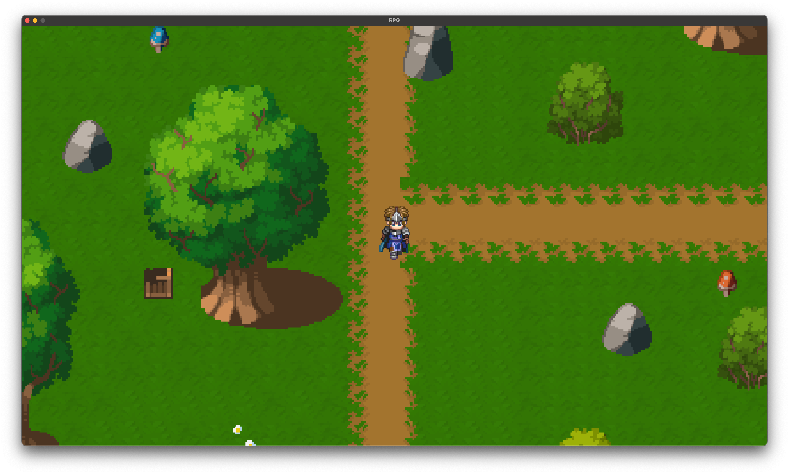

# My RPG - EPITECH Project



## Description

My RPG is a Role-Playing Game developed in C using the CSFML library. This project is part of the EPITECH curriculum and aims to create a complete RPG game with various features including battles, inventory system, and character interactions.

## Features

- Complete battle system
- Character movement and animations
- Menu interface
- Sound effects and music integration
- Inventory management
- Dialogue system
- Save/Load game functionality

## Prerequisites

- GCC compiler
- CSFML library
- Make

## Installation

1. Clone the repository
2. Install CSFML if not already installed:
```bash
sudo apt-get install libcsfml-dev
```
3. Compile the project:
```bash
make
```
4. Run the game:
```bash
./my_rpg
```

## Controls

- Arrow keys: Move character
- E: Interact
- I: Open inventory
- ESC: Pause menu

## Project Structure

- `battle/`: Battle system implementation
- `Include/`: Header files
- `sprite/`: Game sprites and textures
- `src/`: Source files
- `asset/`: Additional assets (images, fonts)

## Authors

- [Your Name]
- [Team Member 1]
- [Team Member 2]
- [Team Member 3]

## License

This project is part of EPITECH's curriculum. Please do not copy or use this code if you are an EPITECH student.